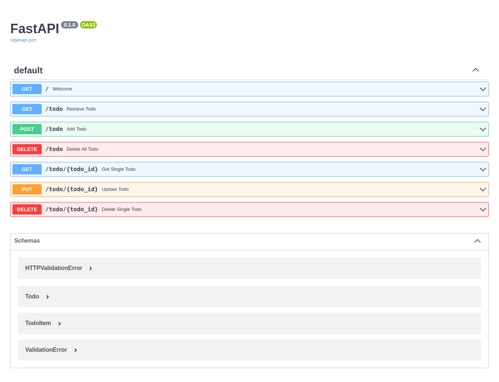
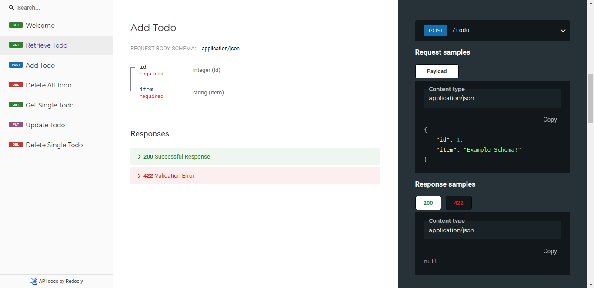

## Chapter 2: Routing in FastAPI

- Technical requirements
- Understanding routing in FastAPI
- Routing with the APIRouter class
- Validating request bodies using Pydantic models
- Path and query parameters
- Request body
- Building a simple CRUD app
- Summary

### Swagger Docs

---

### Redocs

---